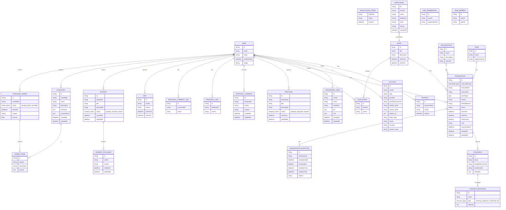

```mermaid
erDiagram
    ACCOUNT {
        string id
        string userId
        string type
        string provider
        stirng providerAccountId
        string refresh_token
        string access_token
        uint expires_at
        string token_type
        string scope
        string id_token
        string session_state
    }
    SESSION {
        string id
        string sessionToken
        string userId
        datetime expires
    }
    USER {
        string id
        stirng name
        string email
        datetime emailVerified
        string image
    }
    VERIFICATION_TOKEN {
        string identifier
        string token
        datetime expires
    }
    REGISTERED_USER {
        string id
        string userId
        string name
        string lastName
        uint dni
        role role
        datetime createdAt
        datetime updatedAt
    }
    BAN {
        string id
        string userId
        string reason
        datetime startTime
        datetime endTime
    }
    FUNGIBLE_RESOURCE {
        string id
        string name
        resource_type type "meeting, auditorium, coworking, lab"
        uint capacity
    }
    RESOURCE {
        string id
        string name
        string fungibleResourceId
        string serialNumber
        json metadata
    }
    RESERVATION {
        string id
        reservable_type reservableType
        string reservableId
        string resourceId
        type eventType
        string reason
        string deniedReason
        status status
        datetime startTime
        datetime endTime
        boolean isRecurring
        string rrule
        datetime recurrenceEnd
        datetime createdAt
        datetime updatedAt
    }
    RESERVATION_EXCEPTION {
        string id
        string reservationId
        datetime exceptionDate
        boolean isCancelled
        datetime newStartTime
        datetime newEndTime
        string reason
    }
    EVENT {
        string id
        string title
        string description
        datetime startTime
        datetime endTime
    }
    USER_EVENT {
        string id
        string eventId
        string userId
    }
    PARTICIPANT {
        string id
        string eventId
        string name
        string lastName
        string email
        string reason
        datetime createdAt
    }
    PROPOSAL {
        string id
        string proposerId
        string title
        string description
        proposal_status status "pending, approved, rejected"
        datetime startTime
        datetime updatedAt
    }
    PROPOSAL_COMMENT {
        string id
        string proposalId
        string userId
        string content
        datetime createdAt
        datetime updatedAt
    }
    PROPOSAL_LIKE {
        string id
        string proposalId
        string userId
    }
    PROPOSAL_COMMENT_LIKE {
        string id
        string commendId
        string userId
    }
    INCIDENT {
        string id
        string reporterId
        string title
        string description
        incident_status status "pending, resolved, closed"
        datetime createdAt
        datetime updatedAt
    }
    INCIDENT_FOLLOWUP {
        string id
        string userId
        string content
        datetime createdAt
        datetime updatedAt
    }
    INVENTORY {
        string id
        string createdBy
        string name
        string description
        uint minStock
        uint currentStock
        datetime createdAt
        datetime updatedAt
    }
    PURCHASE_ORDER {
        string id
        string createdBy
        order_status status "pending, done, cancelled"
        datetime dueDate
        string receipt
        float amount
    }
    ORDER_ITEMS {
        string id
        string orderId
        string inventoryId
        uint amount
    }
    ORGANIZATION {
        string id
        string name
        string description
        string parentId
    }
    ORG_MEMBERSHIP {
        string id
        string userId
        string organizationId
    }
    TEAM {
        string id
        string name
        string organizationId
    }
    TEAM_MEMBER {
        string id
        string userId
        string teamId
    }

    USER ||--o{ SESSION : has
    USER ||--o{ ACCOUNT : linked
    USER ||--o| REGISTERED_USER : is
    USER |o--o{ RESERVATION : has
    EVENT |o--o{ RESERVATION : has
    ORGANIZATION |o--o{ RESERVATION : has
    TEAM |o--o{ RESERVATION : has
    EVENT ||--o{ USER_EVENT : includes
    PARTICIPANT }o--|| EVENT : participates
    USER ||--o{ USER_EVENT : assists
    RESERVATION ||--o{ RESOURCE : reserves
    RESERVATION ||--o{ RESERVATION_EXCEPTION : has
    USER ||--o{ PROPOSAL : propose
    USER ||--o{ PROPOSAL_COMMENT : comment
    USER ||--o{ PROPOSAL_LIKE : like
    USER ||--o{ PROPOSAL_COMMENT_LIKE : like
    USER ||--o{ BAN : banned
    USER ||--o{ INCIDENT : reports
    INCIDENT ||--o{ INCIDENT_FOLLOWUP : contains
    RESOURCE ||--o{ FUNGIBLE_RESOURCE : isFungible
    USER ||--o{ INVENTORY : registers
    USER ||--o{ PURCHASE_ORDER : creates
    PURCHASE_ORDER ||--o{ ORDER_ITEMS : contains
    INVENTORY ||--o{ ORDER_ITEMS : is
```