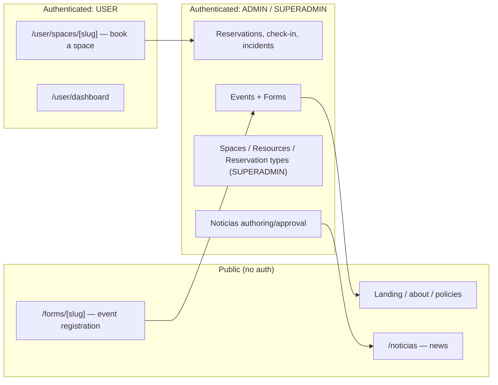

# Overview

## What this is

**La Nube** (`la-nube-coworking`) is the management platform for a coworking /
innovation-hub space run under a "quadruple helix" model (State, Academia,
Industry, Civil society — see the public `/about` page). It has two faces:

- A **public site**: institutional info, policies, and a landing page that
  advertises reservable spaces and upcoming events.
- A **reservation & operations system** behind login: users book spaces
  (coworking desks, meeting rooms, labs, auditorium), admins run workshops/
  classes as recurring "Events" with optional custom registration forms,
  and staff track check-ins, incidents, and (partially) an audit trail of
  admin actions.

Three roles exist beyond the anonymous public visitor: **USER** (booking
member), **ADMIN** (day-to-day operator: reservations, events, forms,
check-in, incidents, news), and **SUPERADMIN** (also configures the catalog
— spaces, resources, reservation types, site config, landing themes — and
can change other users' roles). A fourth, narrower role, **COMUNICADOR**,
can only author/submit Noticias posts. See
[`03-auth-and-permissions.md`](./03-auth-and-permissions.md).

## Who it's for

A single institution's own staff and community members — not a
multi-tenant SaaS product. There is one deployment, one set of spaces.
Members may additionally organize into Teams and (formal partner)
Organizations — see
[`01-domain-model.md`](./01-domain-model.md#planned-not-yet-built-schema-exists-zero-application-code-today) —
but that's _within_ the single institution, not multiple institutions
sharing a deployment.

## Non-goals

These are deliberate scope boundaries, not gaps to "helpfully" fill in:

- **Still not multi-tenant** in the sense of multiple _coworking sites_
  sharing one deployment — one deployment serves one institution, no
  per-request tenant scoping. Note this is narrower than it used to be:
  `Organization`/`Team` (a single institution's members grouping into
  teams or formal partner organizations) is now a planned feature, not a
  non-goal — see
  [`01-domain-model.md`](./01-domain-model.md#planned-not-yet-built-schema-exists-zero-application-code-today).
  Separately, **reselling this codebase as one isolated instance per
  customer** (not shared multi-tenancy) is a confirmed future direction —
  see [`05-resale-and-genericization.md`](./05-resale-and-genericization.md) —
  which doesn't conflict with this non-goal, but does mean parts of the
  system outside the landing page are being kept intentionally generic.
  A confirmed future direction sharpens this further: the backend is
  planned to move to Rust and the landing page to its own separate repo
  entirely, so this repo becomes just the sellable product (backend +
  management UI) — see
  [`06-rust-migration.md`](./06-rust-migration.md).
- **Not a general booking SaaS.** The reservation model is shaped
  specifically around this institution's spaces (exclusive vs.
  capacity-based resources) and its RRULE-based recurring-event pattern —
  not a generic scheduling product.
- **Not a payments/billing product.** No pricing, invoicing, or payment
  processing anywhere in the schema or code.
- **Inventory/procurement and a community suggestion box are also now
  planned**, not non-goals — `Inventory`/`PurchaseOrder` and `Proposal`/
  `ProposalComment` schema exists and each has a milestone doc (see
  [`01-domain-model.md`](./01-domain-model.md#planned-not-yet-built-schema-exists-zero-application-code-today)).
  Neither is built yet, so don't assume either works today.
- **Not real-time.** No websockets/live-sync; state changes are read on
  next request/poll (`ServerTimeProvider` syncs clock, not data).

## How the pieces fit together

See [`01-domain-model.md`](./01-domain-model.md) for the entity-level view
and [`docs/db/DIAGRAM.md`](../db/DIAGRAM.md) for the full ER diagram.

## Relationship to other docs in this repo

This `docs/design/`, `docs/use-cases/`, `docs/foundations/`, and
`docs/rejected/` tree is the **abstract model + rationale** layer, following
the workflow in [`/DOCS-WORKFLOW.md`](../../DOCS-WORKFLOW.md). It coexists
with, and does not replace:

- **`docs/milestones/`** — forward-looking specs for specific pieces of work
  (what to build, before building it). Once a milestone ships, the durable
  "why does the system work this way" belongs here in `docs/design/`; the
  milestone doc stays as historical record of that piece of work.
- **`docs/db/DIAGRAM.md`** — full entity-relationship diagram (all columns).
- **`docs/OPEN_QUESTIONS.md`** — the single running list of unresolved
  product/design decisions, grouped by milestone and by area. This design
  tree adds to that same file rather than keeping a second one — see
  [`NN-open-questions.md`](./NN-open-questions.md), which is a pointer, not
  a fork.
- **`docs/changes/`** — an older, ad hoc log of implementation notes from
  earlier in the project. Superseded going forward by this structure; not
  backfilled/reorganized retroactively (see
  [`docs/rejected/0001-retroactive-docs-migration.md`](../rejected/0001-retroactive-docs-migration.md)).
