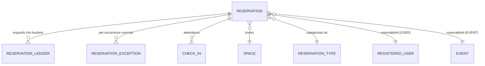
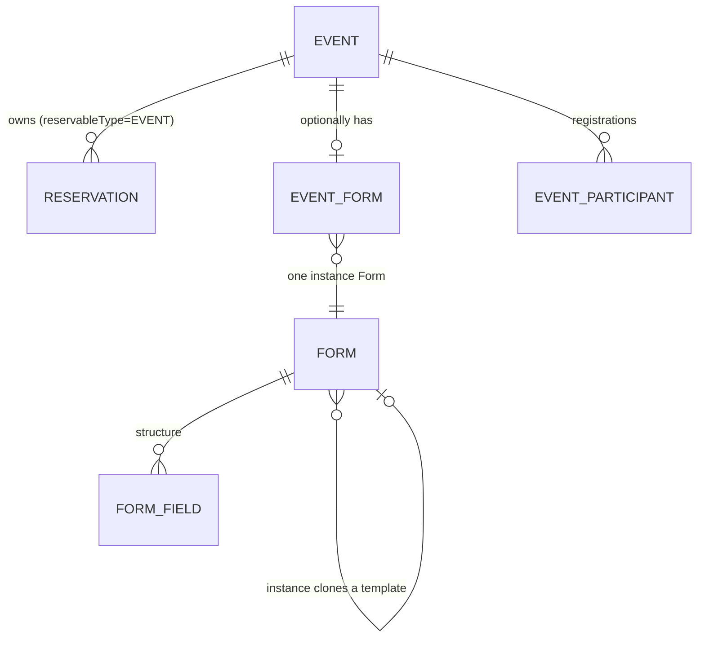

# Domain model

Core entities and how they relate. For every column, see
[`docs/db/DIAGRAM.md`](../db/DIAGRAM.md) (generated from `prisma/models/*.prisma`).

## Identity

- **User** (NextAuth) → **RegisteredUser** (1:1, our profile). `User` handles
  credentials/sessions; `RegisteredUser` is created only after email
  verification + the signup profile step, and is what the rest of the app
  joins against (name, DNI, institution, `role`, bans).
- **Role** is one of `USER / ADMIN / SUPERADMIN / COMUNICADOR`, carried on
  `RegisteredUser`. Permissions are **code-defined per role**, not stored —
  see [`03-auth-and-permissions.md`](./03-auth-and-permissions.md).
- **Ban**: time-bounded suspension of a `RegisteredUser`.

## Space & resource catalog (SUPERADMIN-managed)

- **Space**: a reservable place (coworking, lab, auditorium, meeting room)
  with `capacity`, `exclusive` (one approved reservation at a time vs.
  capacity-shared), `reservable` flags, and an editable `slug`. The single
  dynamic route `/user/spaces/[slug]` resolves a Space by slug — there is no
  per-space hardcoded page.
- **Resource**: physical equipment inventory, independent of Space
  reservability.
- **ReservationType**: catalog of reservation/event types (MEETING /
  WORKSHOP / CONFERENCE / OTHER, seeded, extensible). `code` is the stable
  FK target from `Reservation.eventType` / `Event.eventType`; `name` is
  display-only.

## Reservations (the booking core)

- **Reservation**: one row per booking, one-time or recurring (RRULE +
  `recurrenceEnd`). `reservableId` is a **polymorphic** pointer — for a
  USER booking it's a `RegisteredUser.id`; for an EVENT-owned reservation
  it's an `Event.id`. There is no DB-level FK enforcing this (see
  [`02-architecture.md`](./02-architecture.md#polymorphic-reservable_id) for
  why).
- **ReservationLedger**: the reservation's occurrences expanded into 15-min
  buckets. This is the thing capacity/availability checks actually query —
  the RRULE itself is not re-expanded on every read.
- **ReservationException**: a saved override for a single occurrence of a
  recurring reservation (cancel one date, reschedule one date). Applied on
  top of the RRULE expansion at read time.
- **CheckIn**: an entry/exit record linked to a specific reservation.

## Events & forms (recurring, admin-run activities)

- **Event**: admin-run workshop/class on a weekly cadence, on a specific
  Resource. Creating one materializes **one weekly-recurring `Reservation`
  per selected weekday**, `APPROVED`, sized to fully occupy the resource.
  `Event.status` is `DRAFT / PUBLISHED / PAUSED` (stored); `ENDED` and
  `CANCELLED` are **derived**, never stored (`eventDisplayStatus()`).
  `deletedAt` is a soft delete that frees the reservations but keeps
  history.
- **Form** / **FormField**: a form's structure. A `Form` is either a
  reusable **template** (`isTemplate=true`, built in `/admin/forms`) or a
  per-event **instance** (`isTemplate=false`), cloned from a template when
  bound to an event. Editing/deleting a template never touches an
  already-cloned instance.
- **EventForm**: binds one cloned instance `Form` to one `Event`; carries
  the public `slug` and the registration open/close window.
- **EventParticipant**: one registration, unique per `(eventId, email)`
  (normalized). Carries `status` (`PENDING / APPROVED / REJECTED /
CANCELLED`), edit links for account-free self-service edit/cancel
  (`EventParticipantEditToken`: only the SHA-256 is stored, one per email
  that carried a link, all valid until the event ends — milestone 25, S5),
  and optional `userId` if the registrant is also a platform user.
  `SPOT_HOLDING_STATUSES` (PENDING + APPROVED) is the one place "does this
  count toward capacity" is decided — see
  [`04-events-and-forms.md`](./04-events-and-forms.md).

## Content & ops (smaller, mostly independent subsystems)

- **NewsPost** (+ Comunicador role): public "Noticias" posts, with an
  approval step (`news:manage` to author/submit, `news:approve` to publish).
- **LandingTheme**: superadmin-configurable date-windowed landing takeovers
  (v1: entrance effect + hero copy override; v2 fields — accent preset,
  banner — exist in schema but are unused, see
  [open questions](../OPEN_QUESTIONS.md)).
- **SiteConfig**: singleton row (`id = "site"`) holding public contact
  info, editable by SUPERADMIN, replacing what used to be a hardcoded
  constants file.
- **Incident** / **IncidentUser**: incident tracking, admin-only.
- **RateLimit**: DB-backed rate limiting keyed by `(key, endpoint)`.
- **Audit trail** (migration/schema exists — see `docs/milestones/
milestones-2-audit-trail.md`): records admin mutations with a before/after
  diff. Only a subset of admin routes are instrumented so far; see
  [`docs/OPEN_QUESTIONS.md`](../OPEN_QUESTIONS.md#milestone-2--audit-trail).

## Planned, not yet built (schema exists, zero application code today)

These models are defined in `prisma/models/*.prisma` and migrated into the
database, but nothing in `src/` reads or writes them yet — no route, no
query helper, no UI. Unlike a truly dormant/rejected feature, each of these
now has a real use case and a milestone doc (confirmed 2026-09-21):

- `Organization`, `Team`, `OrgMembership`, `TeamMember` — teams (standalone
  or org-affiliated) and organizations, with email-invite membership and
  team-size-driven reservation capacity. The schema's `ORGANIZATION`/`TEAM`
  `ReservableType` values and `get_actor_size()` SQL support already exist
  and are ready to be wired up. See
  [`../milestones/milestones-6-teams-and-organizations.md`](../milestones/milestones-6-teams-and-organizations.md).
- `Proposal`, `ProposalComment`, `ProposalLike`, `ProposalCommentLike` — a
  community suggestion box (markdown proposals, one-level comment threads,
  admin approve/reject with a reason). See
  [`../milestones/milestones-7-proposals.md`](../milestones/milestones-7-proposals.md).
- `Inventory`, `PurchaseOrder` — physical stock tracking with a low-stock
  threshold that auto-populates a purchase order; the current schema shape
  (one `PurchaseOrder` row per item) doesn't match the described use case
  and needs restructuring into line items before this is built. See
  [`../milestones/milestones-8-inventory-and-purchase-orders.md`](../milestones/milestones-8-inventory-and-purchase-orders.md).

None of these are built yet — treat the schema as a head start, not as
already-working functionality.
