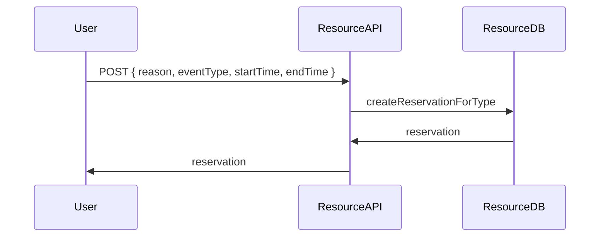

```mermaid
sequenceDiagram
    participant User
    participant ResourceAPI
    participant ResourceDB
    User->> ResourceAPI: POST { reason, eventType, startTime, endTime }
    ResourceAPI ->> ResourceDB: createReservationForType
    ResourceDB ->> ResourceAPI: reservation
    ResourceAPI ->> User: reservation
```