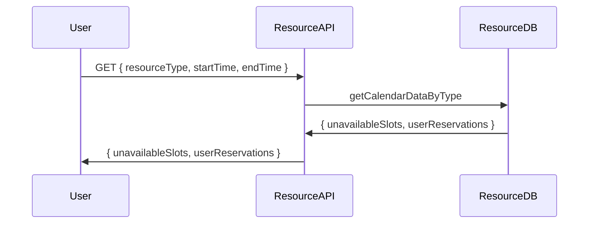

```mermaid
sequenceDiagram
    participant User
    participant ResourceAPI
    participant ResourceDB
    User->> ResourceAPI: GET { resourceType, startTime, endTime }
    ResourceAPI ->> ResourceDB: getCalendarDataByType
    ResourceDB ->> ResourceAPI: { unavailableSlots, userReservations }
    ResourceAPI ->> User: { unavailableSlots, userReservations }
```