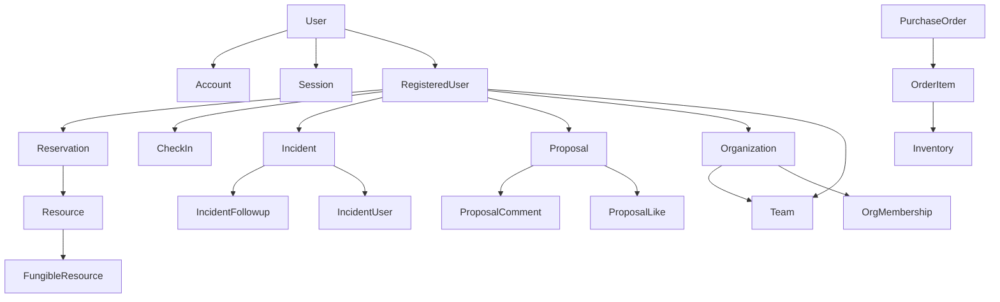

# Prisma Schema Structure

This project uses Prisma's modular schema feature (available from v6.7.0+) to organize models into separate files by domain/theme in the `prisma/models/` folder.

## 📁 Model Files

The schema is organized into the following model files:

### `auth.prisma`
Authentication and user management models:
- `Account` - OAuth account linking
- `Session` - User sessions  
- `User` - Core user model (minimal, for auth)
- `RegisteredUser` - Extended user profile with full details
- `VerificationToken` - Email verification tokens
- `UserRole` enum

**Key Relationship:** `User` ↔ `RegisteredUser` (one-to-one). The `User` model handles authentication only, while `RegisteredUser` contains the full user profile and all app relationships.

### `bans.prisma`
User ban management:
- `Ban` - User ban records

### `resources.prisma`
Resource management for bookable items:
- `FungibleResource` - Resource types (meeting rooms, coworking spaces, etc.)
- `Resource` - Individual resource instances
- `ResourceType` enum

### `reservations.prisma`
Reservation and check-in system:
- `Reservation` - Resource reservations
- `ReservationException` - Exceptions to recurring reservations
- `CheckIn` - User check-ins
- `ReservableType`, `EventType`, `ReservationStatus` enums

### `events.prisma`
Event management:
- `Event` - Events/activities
- `UserEvent` - RegisteredUser-event relationships
- `Participant` - External event participants

### `proposals.prisma`
Community proposal system:
- `Proposal` - Community proposals
- `ProposalComment` - Comments on proposals
- `ProposalLike` - Likes on proposals
- `ProposalCommentLike` - Likes on comments
- `ProposalStatus` enum

### `incidents.prisma`
Incident reporting and tracking:
- `Incident` - Incident reports
- `IncidentFollowup` - Follow-up messages on incidents
- `IncidentUser` - RegisteredUsers involved in incidents
- `IncidentStatus` enum

### `inventory.prisma`
Inventory and purchase management:
- `Inventory` - Inventory items
- `PurchaseOrder` - Purchase orders
- `OrderItem` - Items in purchase orders
- `OrderStatus` enum

### `organizations.prisma`
Organizations and teams:
- `Organization` - Organizations (with hierarchy support)
- `OrgMembership` - RegisteredUser-organization memberships
- `Team` - Teams within organizations
- `TeamMember` - RegisteredUser-team memberships

## 🔄 How It Works

Starting from **Prisma v6.7.0**, models are automatically imported from the `prisma/models/` folder. You don't need any build scripts or manual imports!

The `schema.prisma` file only contains:
- Generator configuration
- Datasource configuration
- A comment noting where models are located

When you run any Prisma command (`generate`, `migrate`, etc.), Prisma automatically discovers and includes all `.prisma` files from the `models/` folder.

## 🚀 Usage

### Working with Models

1. **Edit models** - Directly edit files in `prisma/models/`
2. **Run Prisma commands** - Use normal Prisma CLI commands:

```bash
# Generate Prisma Client
npm run db:generate

# Create and apply migrations
npm run db:migrate

# Push schema to database without migrations
npm run db:push

# Reset database and seed
npm run db:reset

# Open Prisma Studio
npm run db:studio
```

### Adding New Models

To add a new model:

1. Create a new `.prisma` file in `prisma/models/` or edit an existing one
2. Define your model with proper relations
3. Run `npm run db:migrate` to create a migration
4. That's it! Prisma automatically picks up the new model

### Creating New Model Files

If you need a new domain/theme:

1. Create `prisma/models/your-domain.prisma`
2. Add a comment at the top describing the domain
3. Add your models and enums
4. Run migrations as usual

Example:

```prisma
// Notification System Models

model Notification {
  id        String   @id @default(cuid())
  userId    String   @map("user_id")
  title     String
  content   String
  read      Boolean  @default(false)
  createdAt DateTime @default(now()) @map("created_at")

  registeredUser RegisteredUser @relation(fields: [userId], references: [id], onDelete: Cascade)

  @@index([userId])
  @@map("notifications")
}
```

## 🏗️ User vs RegisteredUser

This schema separates authentication from user profiles:

- **`User`** - Minimal model for NextAuth.js authentication
  - Contains: `id`, `email`, `emailVerified`, `name`, `image`
  - Has: `accounts[]`, `sessions[]`, `registeredUser?`
  
- **`RegisteredUser`** - Full user profile for app features
  - Contains: `name`, `lastName`, `dni`, `institution`, `reasonToJoin`, `role`
  - Has all app relationships: `reservations[]`, `checkIns[]`, `proposals[]`, etc.
  - One-to-one with `User` via `userId`

**Why?** This allows users to authenticate via OAuth without immediately requiring full registration, enabling a two-step onboarding flow.

## 📊 Entity Relationships



For a complete ER diagram, see [DIAGRAM.md](./DIAGRAM.md).

## 📝 Benefits

- **Organization**: Models grouped by domain, easy to navigate
- **Maintainability**: Small files are easier to understand
- **No Build Step**: Prisma handles imports automatically
- **Collaboration**: Fewer merge conflicts
- **Scalability**: Easy to add new domains

## 🔧 Migration from Build Script

If you previously used `build-schema.js`:

1. ✅ Models are now in `prisma/models/` (not `prisma/entities/`)
2. ✅ No build script needed
3. ✅ `package.json` scripts simplified (no `db:build`)
4. ✅ Just run normal Prisma commands

## 📚 Resources

- [Prisma Multi-file Schema](https://www.prisma.io/docs/orm/prisma-schema/overview/schema-files)
- [Prisma Schema Reference](https://www.prisma.io/docs/reference/api-reference/prisma-schema-reference)
